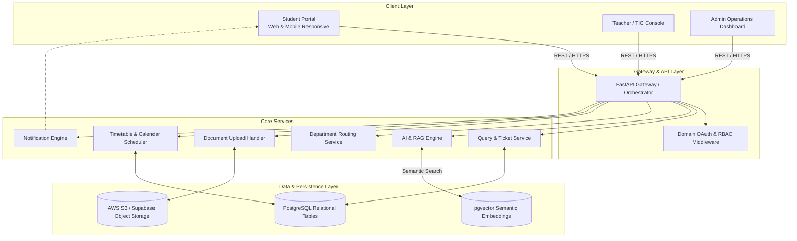
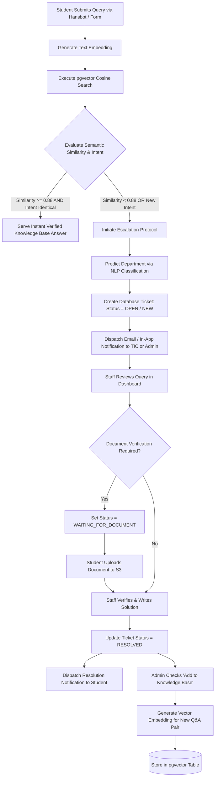

# Hansraj Chatbot: Comprehensive System Architecture & Project Blueprint

## 1. Executive Summary & Core Philosophy
* **Project Name:** Hansraj Chatbot (The Ledger)
* **Target Scale:** ~8,000 Verified Students, Faculty, and Administrative Staff
* **Core Philosophy:** *AI understands. Database remembers. Backend governs. Humans verify.*
* **Primary Objective:** Build a verified institutional query-resolution and knowledge-routing platform. The Large Language Model (LLM) serves strictly as an intent-classifier, semantic-matcher, and response-generator using Retrieval-Augmented Generation (RAG). It is never an unverified source of truth.

---

## 2. Technology Stack & Component Mapping

| Layer | Selected Technology | Architectural Justification |
| :--- | :--- | :--- |
| **Frontend** | Next.js (React) + Tailwind CSS + shadcn/ui | Multi-role routing (`/student`, `/admin`, `/tic`), responsive chat components, fast table/card rendering. |
| **Backend API** | Python (FastAPI) | High-throughput asynchronous REST APIs; seamless integration with Python AI/NLP ecosystems. |
| **Relational Database** | PostgreSQL | Strict ACID compliance, relational integrity for tickets, user roles, audit trails, and document mappings. |
| **Vector Engine** | `pgvector` (PostgreSQL Extension) | High-dimensional embedding storage & cosine similarity search within the primary database, eliminating dual-DB sync overhead. |
| **AI / RAG Pipeline** | Gemini API / OpenAI + LlamaIndex | Document parsing, text chunking, embedding generation, semantic retrieval, and intent classification. |
| **Authentication** | Google OAuth 2.0 / JWT | Strict domain restriction enforcing `@hrc.du.ac.in` logins with Role-Based Access Control (RBAC). |
| **File Storage** | AWS S3 / Supabase Storage | Secure object storage for uploaded circulars, notices, and student verification documents. |
| **Notifications** | Resend / SendGrid API | Asynchronous email triggers on query creation, routing updates, meeting scheduling, and resolutions. |

---

## 3. End-to-End System Architecture



---

## 4. Query Resolution & Escalation Flow



---

## 5. Database Schema & Data Models

### 5.1 Tables & Entity Definitions

```sql
-- Enable Vector Extension
CREATE EXTENSION IF NOT EXISTS vector;

-- User Table with Role-Based Separation
CREATE TABLE users (
    id UUID PRIMARY KEY DEFAULT gen_random_uuid(),
    name VARCHAR(255) NOT NULL,
    email VARCHAR(255) UNIQUE NOT NULL, -- Restrict to @hrc.du.ac.in
    roll_number VARCHAR(50),
    course VARCHAR(100),
    year INT,
    role VARCHAR(20) NOT NULL CHECK (role IN ('STUDENT', 'TIC', 'ADMIN', 'SUPERADMIN')),
    department_id UUID REFERENCES departments(id),
    created_at TIMESTAMP WITH TIME ZONE DEFAULT CURRENT_TIMESTAMP
);

-- Departments / Administrative Units
CREATE TABLE departments (
    id UUID PRIMARY KEY DEFAULT gen_random_uuid(),
    name VARCHAR(100) NOT NULL,
    tic_user_id UUID REFERENCES users(id),
    created_at TIMESTAMP WITH TIME ZONE DEFAULT CURRENT_TIMESTAMP
);

-- Core Query / Ticket Table
CREATE TABLE queries (
    id UUID PRIMARY KEY DEFAULT gen_random_uuid(),
    student_id UUID NOT NULL REFERENCES users(id),
    title VARCHAR(255) NOT NULL,
    description TEXT NOT NULL,
    category VARCHAR(100),
    assigned_department_id UUID REFERENCES departments(id),
    assigned_to_user_id UUID REFERENCES users(id),
    status VARCHAR(50) DEFAULT 'NEW' CHECK (status IN (
        'NEW', 
        'IN_REVIEW', 
        'FORWARDED_TO_TIC', 
        'WAITING_FOR_DOCUMENT', 
        'DOCUMENT_SUBMITTED', 
        'RESOLVED', 
        'REJECTED'
    )),
    created_at TIMESTAMP WITH TIME ZONE DEFAULT CURRENT_TIMESTAMP,
    updated_at TIMESTAMP WITH TIME ZONE DEFAULT CURRENT_TIMESTAMP
);

-- Verified Solutions
CREATE TABLE solutions (
    id UUID PRIMARY KEY DEFAULT gen_random_uuid(),
    query_id UUID UNIQUE NOT NULL REFERENCES queries(id),
    resolved_by UUID NOT NULL REFERENCES users(id),
    solution_text TEXT NOT NULL,
    requires_document BOOLEAN DEFAULT FALSE,
    created_at TIMESTAMP WITH TIME ZONE DEFAULT CURRENT_TIMESTAMP
);

-- Uploaded Documents
CREATE TABLE documents (
    id UUID PRIMARY KEY DEFAULT gen_random_uuid(),
    query_id UUID REFERENCES queries(id),
    uploaded_by UUID NOT NULL REFERENCES users(id),
    file_url TEXT NOT NULL,
    document_type VARCHAR(100),
    status VARCHAR(50) DEFAULT 'PENDING' CHECK (status IN ('PENDING', 'VERIFIED', 'REJECTED')),
    created_at TIMESTAMP WITH TIME ZONE DEFAULT CURRENT_TIMESTAMP
);

-- Faculty-Student Meeting Bookings
CREATE TABLE meetings (
    id UUID PRIMARY KEY DEFAULT gen_random_uuid(),
    query_id UUID REFERENCES queries(id),
    student_id UUID NOT NULL REFERENCES users(id),
    tic_id UUID NOT NULL REFERENCES users(id),
    scheduled_start TIMESTAMP WITH TIME ZONE NOT NULL,
    scheduled_end TIMESTAMP WITH TIME ZONE NOT NULL,
    meeting_link TEXT,
    status VARCHAR(50) DEFAULT 'SCHEDULED' CHECK (status IN ('SCHEDULED', 'COMPLETED', 'CANCELLED')),
    created_at TIMESTAMP WITH TIME ZONE DEFAULT CURRENT_TIMESTAMP
);

-- Vector-Indexed Knowledge Base
CREATE TABLE knowledge_base (
    id UUID PRIMARY KEY DEFAULT gen_random_uuid(),
    question TEXT NOT NULL,
    answer TEXT NOT NULL,
    department_id UUID REFERENCES departments(id),
    source_query_id UUID REFERENCES queries(id),
    is_verified BOOLEAN DEFAULT TRUE,
    embedding vector(1536), -- Vector size matching OpenAI / Gemini embedding dimensions
    created_at TIMESTAMP WITH TIME ZONE DEFAULT CURRENT_TIMESTAMP
);

-- Cosine Distance Index for High Performance Vector Search
CREATE INDEX kb_embedding_idx ON knowledge_base USING ivfflat (embedding vector_cosine_ops) WITH (lists = 100);
```

---

## 6. API Route Specification (FastAPI Backend)

### Authentication & Profiles
* `POST /api/v1/auth/google` - Exchanges Google OAuth token, validates `@hrc.du.ac.in` domain, issues JWT.
* `GET /api/v1/users/me` - Retrieves current authenticated user context and role.

### AI Search & Retrieval
* `POST /api/v1/ai/query-search` - Performs embedding generation and cosine similarity lookup against `knowledge_base`.
* `POST /api/v1/ai/classify-intent` - Predicts target department and categorizes unresolved text input.

### Student Query Operations
* `POST /api/v1/queries` - Creates a new ticket (via automated bot fallback or direct manual form).
* `GET /api/v1/student/queries` - Lists all queries raised by the student with current status markers.
* `GET /api/v1/queries/{query_id}` - Detailed view of query lifecycle, stepper progress, and staff notes.
* `POST /api/v1/queries/{query_id}/documents` - Attaches S3 file references to a query awaiting verification.

### Staff & TIC Operations
* `GET /api/v1/tic/queries` - Retrieves department-scoped query queue with filters for `NEW`, `IN_REVIEW`, and `RESOLVED`.
* `PATCH /api/v1/queries/{query_id}/resolve` - Submits resolution, updates ticket status, triggers student notification.
* `POST /api/v1/queries/{query_id}/forward` - Forwards a ticket from central Admin to a specific Department TIC.
* `POST /api/v1/knowledge-base/publish` - Adds a verified resolution directly into the `knowledge_base` with calculated embeddings.

### Meetings & Scheduling
* `GET /api/v1/tic/{tic_id}/available-slots` - Calculates available office hours without timetable conflicts.
* `POST /api/v1/meetings/book` - Locks an appointment slot and sends calendar invites to student and teacher.

---

## 7. UI Module Breakdown (From Sketch to Production)

### 7.1 Student Addon Interface
1. **Onboarding & Auth:**
   * Single sign-on supporting College Google Workspace accounts.
   * Auto-populates Student Name, Roll Number, Course, and Academic Year.
2. **Hansbot Interactive Chat:**
   * Dynamic chat window with streaming markdown responses.
   * Quick-filter selection chips (`Document Verification`, `Attendance Discrepancy`, `Fee Receipts`, `Exam Form`).
3. **Student Dashboard ("My Queries"):**
   * Tabular split: **Existing** (Active/Historical tickets) vs **New** (Direct manual ticket creation).
   * Visual progress stepper: `Submitted` $\rightarrow$ `In Review` $\rightarrow$ `Action Required` $\rightarrow$ `Resolved`.

### 7.2 Teacher & Admin Console
1. **Queue Management:**
   * Tabular view listing `S.No`, `Query Raised By`, `Student Roll No`, `Subject Category`, and `Current Status`.
   * Fast toggle for Unresolved (`UNS`) vs Resolved (`RES`).
2. **Resolution Workspace:**
   * Split pane showing student submission history and attached S3 documents.
   * Markdown editor for typing resolutions.
   * Single-click toggle: *"Publish answer to institutional AI Knowledge Base"*.