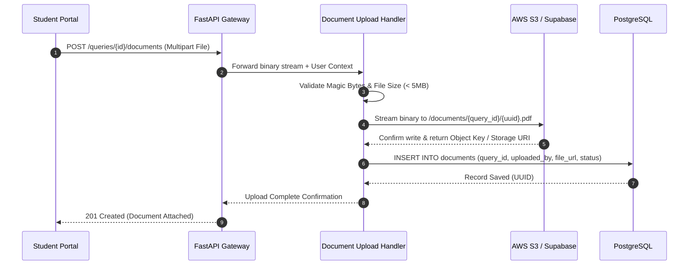
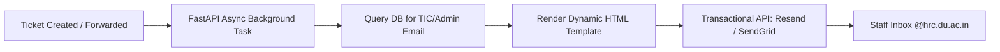

# why used this and not that
## 1. Frontend: Next.js (React) + Tailwind CSS

* **Alternatives Considered:** Single Page Apps with Vite/React, Vue.js/Nuxt, Angular, or SvelteKit.
* **Architectural Analysis:**
  * **Role-Based Layouts:** The portal requires three distinct user interfaces: `/student`, `/tic`, and `/admin`. Next.js App Router allows nested layout hierarchies where layout state remains mounted while sub-pages transition instantly.
  * **Optimized Rendering & SEO-readiness:** Student dashboards require dynamic client rendering for interactive streaming chat and live forms, while public circulars and institutional knowledge FAQs can be pre-rendered using Server Components (RSC) to reduce client-side JavaScript execution.
  * **Tailwind CSS & Component Ecosystem:** In educational institution software, building accessible, dense data tables (for the Teacher Console) and interactive chat bubbles from scratch slows development. Tailwind paired with headless UI primitives (`shadcn/ui`) delivers accessible, production-grade dashboards without CSS bloat.


* **Why Not Vite/CRA or Angular?** Vite-based SPAs require separate routing libraries, client-side-only auth guards that cause initial screen flicker, and manual bundle optimization. Angular introduces heavy enterprise boilerplate that slows rapid feature iterations.

---

## 2. Backend Engine: Python (FastAPI)

* **Alternatives Considered:** Node.js (Express/NestJS), Python (Django), Go (Gin/Fiber), Java (Spring Boot).
* **Architectural Analysis:**
  * **Native AI/NLP Ecosystem:** The core backend must interact with vector operations, embedding models, tokenizers, and LLM SDKs (OpenAI, Gemini, LlamaIndex, NumPy). In a Node.js or Java stack, running advanced NLP pipelines requires spawning Python microservice sidecars or writing complex bridge APIs. FastAPI keeps the business logic and AI pipeline in a unified Python environment.
  * **Asynchronous Performance (ASGI):** Query generation and vector searches are high-latency I/O operations. FastAPI’s native `async`/`await` engine based on Starlette handles thousands of concurrent student connections without thread-blocking.
  * **Pydantic Type Safety & Automated Docs:** Automatic request/response validation prevents malformed ticket submissions and generates interactive OpenAPI/Swagger documentation (`/docs`) out of the box.


* **Why Not Django or Express?** Django is synchronous by default and comes with a heavy ORM overhead that complicates custom vector index queries. Express lacks native data validation, type safety, and first-class async data pipelines.

---

## 3. Primary Relational Storage: PostgreSQL

* **Alternatives Considered:** MongoDB, MySQL, Firebase Firestore, DynamoDB.
* **Architectural Analysis:**
  * **Strict Relational Integrity:** College administration data is deeply relational: a `Student` belongs to a `Department`, submits a `Query`, which spawns a `Solution` written by a `Teacher`, linking to uploaded `Documents` and scheduled `Meetings`. PostgreSQL enforces foreign key constraints and cascade rules, preventing orphaned records.
  * **State Machine Guarantees:** Tickets progress through explicit status stages (`NEW` $\rightarrow$ `IN_REVIEW` $\rightarrow$ `WAITING_FOR_DOCUMENT` $\rightarrow$ `RESOLVED`). PostgreSQL `CHECK` constraints and `ENUM` types guarantee that tickets cannot enter invalid or undefined states.
  * **ACID Compliance for Auditing:** Academic dispute resolutions and document verification demand strict transactional consistency so no query status is lost during simultaneous updates.


* **Why Not MongoDB / NoSQL?** Document stores lack multi-table relational enforcement. Modeling students, departments, and ticket events in MongoDB requires manual application-level joins, leading to eventual consistency issues and data drift.

---

## 4. Vector Search Engine: `pgvector` (PostgreSQL Extension)

* **Alternatives Considered:** Dedicated Vector Databases (Pinecone, Weaviate, Qdrant, Milvus, Chroma).
* **Architectural Analysis:**
  * **Elimination of the "Dual-Database Problem":** Using an external vector database (like Pinecone) creates architectural split-brain. You must store relational data (student info, department IDs) in Postgres and vector embeddings in Pinecone, requiring distributed two-phase commits to keep them in sync. If Pinecone fails or lags, queries return answers referencing non-existent records.
  * **Single-Query Relational + Semantic Filtering:** With `pgvector`, you can execute unified SQL queries combining vector cosine similarity with standard relational filters in one database hit:


    ```sql
    SELECT question, answer, 1 - (embedding <=> $query_embedding) AS similarity
    FROM knowledge_base
    WHERE department_id = $dept_id AND is_verified = TRUE
    ORDER BY similarity DESC LIMIT 3;

    ```


* **Cost & Operational Simplicity:** Running `pgvector` inside the existing PostgreSQL container adds $0 in additional cloud infrastructure costs and requires zero external network latency.


* **Why Not Pinecone or Milvus?** For a campus size of ~8,000 students and a knowledge base of ~50,000 Q&A pairs, standalone vector clusters are overkill, introduce cold-start latency, and carry recurring API/subscription costs.

---

## 5. AI Layer: Gemini / OpenAI API + LlamaIndex

* **Alternatives Considered:** Self-hosted Open-Source Models (Llama 3 / Mistral on local servers), Raw Prompting without RAG.
* **Architectural Analysis:**
  * **Managed APIs vs. Self-Hosting:** Running open-source 70B parameter models with sub-second latency requires continuous access to enterprise-grade GPUs (such as NVIDIA A100/H100 clusters), which are expensive and complex to maintain. API-based models offer instant auto-scaling, high availability, and structured JSON output modes.
  * **LlamaIndex for Document Ingestion:** Instead of building raw chunking mathematics, LlamaIndex handles PDF parsing, semantic boundary splitting (keeping paragraphs and bullet points intact), metadata extraction, and vector index generation reliably.
  * **Guaranteed Hallucination Mitigation:** Standard LLMs will guess answers when uncertain. The RAG architecture forces the LLM to inspect retrieved context from the verified database. If semantic similarity falls below the threshold, the backend halts generation and escalates directly to human staff.


---

## 6. Authentication: Domain-Restricted Google OAuth 2.0

* **Alternatives Considered:** Custom Email + Password with manual OTP, Roll Number + Password matching, Third-party Auth (Clerk / Auth0).
* **Architectural Analysis:**
  * **Zero User-Onboarding Friction:** Hansraj College operates on Google Workspace (`@hrc.du.ac.in`). Enforcing server-side validation (`hd=hrc.du.ac.in`) means 8,000 students and hundreds of faculty members can log in instantly on day one without creating new passwords or waiting for activation emails.
  * **Zero Credential Liability:** The database never stores passwords, hashes, or salt keys. This eliminates attack vectors such as credential stuffing, SQL injection into password fields, and brute-force attacks.
  * **Authentic Identity Guarantee:** The email address returned by the Google OAuth token is cryptographically signed, proving the user's active affiliation with the institution.


---

## 7. Storage Layer: AWS S3 / Supabase Storage

* **Alternatives Considered:** Storing binary files (BLOBs) directly inside PostgreSQL, storing files on the local web server disk.
* **Architectural Analysis:**
  * **Database Performance Preservation:** Storing PDFs and image documents inside PostgreSQL tables as `BYTEA` bloats the database size exponentially, degrading memory caching and index performance.
  * **Stateless Backend Compatibility:** Modern web applications are deployed as stateless containers (e.g., Docker on Render/AWS). Storing files on local disk means files are lost every time the server restarts or scales horizontally.
  * **Pre-Signed URLs:** S3 object storage enables secure, expiring pre-signed URLs so that confidential student documents (medical certificates, fee receipts) can only be viewed by authorized TICs.


---

## 8. Notifications: Transactional Email API (Resend / SendGrid)

* **Alternatives Considered:** Self-hosted Linux SMTP Server (Postfix), In-App notifications only.
* **Architectural Analysis:**
  * **Asynchronous Query Resolution:** Since administrative queries often take 24–48 hours for staff to review, students are not constantly active on the web app. Out-of-band email notifications are required to alert students the moment a ticket is resolved.
  * **Inbox Deliverability (SPF/DKIM/DMARC):** Self-hosted mail servers often lack dedicated IP reputation and frequently land in spam or get blocked by institutional Google Workspace mail firewalls. Managed services handle authentication handshakes and rate limiting reliably.


---
---

### 1. Domain OAuth & RBAC Middleware (`Auth`)

* **Input:** HTTP `Authorization` header containing a Google OAuth 2.0 `id_token` or session JWT, requested route URL, and HTTP request method.
* **Output:** Validated user context (`user_id`, `email`, `role`, `department_id`) injected into the request state, or an immediate `401 Unauthorized` / `403 Forbidden` response.
* **What It Actually Does:**
  * Intercepts every incoming HTTP request before reaching business logic controllers.
  * Verifies the cryptographic signature of the token against Google’s public JSON Web Key Sets (JWKS).
  * Enforces institutional tenancy by asserting that the payload claim contains `hd == "hrc.du.ac.in"`.
  * Queries the internal cache/database to retrieve the user's granular role (`STUDENT`, `TIC`, `ADMIN`, `SUPERADMIN`).
  * Evaluates Role-Based Access Control (RBAC) rules against route path prefixes (e.g., rejecting non-faculty attempts to access `/api/v1/tic/*`).


* **Potential Technical & Viva Questions:**
  * *What happens if an external user attempts to log in with a standard `@gmail.com` account?*
    The middleware decodes the token payload and checks the Hosted Domain (`hd`) claim. If the claim is missing or does not match `hrc.du.ac.in`, execution terminates with an HTTP 403 Forbidden error before any database queries execute.
  * *How do you prevent database bottlenecks if the middleware checks user roles on every single API call?*
    After initial Google token exchange, the backend issues an ephemeral, cryptographically signed internal JWT (e.g., 15-minute expiration) containing the `user_id` and `role` claims. The middleware validates this token statelessly via public-key cryptography without hitting PostgreSQL on every request.

---

### 2. FastAPI Gateway / Orchestrator (`API`)

* **Input:** Client-originating HTTPS REST payloads, multipart form data (document uploads), and query parameters.
* **Output:** Standardized JSON response envelopes, streaming Server-Sent Events (SSE) for token-by-token LLM output, and HTTP status codes.
* **What It Actually Does:**
  * Acts as the central ASGI (Asynchronous Server Gateway Interface) reverse proxy and router for the entire backend application.
  * Executes runtime payload validation using Pydantic schemas, rejecting malformed JSON before it touches service workers.
  * Manages the asynchronous event loop (`asyncio`), dispatching I/O-bound tasks (database queries, network requests to LLM APIs, object storage uploads) concurrently across worker threads.
  * Implements global exception handling, Cross-Origin Resource Sharing (CORS) policies, and rate limiting (preventing API abuse).


* **Potential Technical & Viva Questions:**
  * *Why choose FastAPI over Node.js (Express) or Python (Django)?*
    FastAPI natively supports Python's asynchronous ecosystem while enabling direct in-memory integration with AI/NLP libraries. Node.js requires a separate Python microservice for NLP tasks, while Django introduces synchronous ORM overhead that complicates custom vector index queries.
  * *How does FastAPI prevent slow AI model responses from blocking other users?*
    FastAPI runs on an ASGI server (Uvicorn) utilizing non-blocking asynchronous event loops (`async`/`await`). When an endpoint awaits an external LLM response or vector database read, the thread releases control to process concurrent incoming requests.

---

### 3. AI & RAG Engine (`AISvc`)

* **Input:** Raw natural language question strings from students, conversation history window, and retrieval configuration parameters.
* **Output:** JSON evaluation object:
    ```json
    {
    "is_confident": true,
    "confidence_score": 0.92,
    "answer": "To obtain a Bonafide Certificate, submit your fee receipt at Window 3...",
    "source_document_id": "8f3c2b1a-..."
    }

    ```

* **What It Actually Does:**
  * Converts user input text into a high-dimensional dense vector representation $\mathbf{u} \in \mathbb{R}^{1536}$ using an embedding model.
  * Executes an Approximate Nearest Neighbor (ANN) cosine distance search over the `knowledge_base` table in PostgreSQL:

    $$\text{Cosine Similarity} = 1 - \text{Cosine Distance} = \frac{\mathbf{u} \cdot \mathbf{v}}{\Vert{}\mathbf{u}\Vert{}_2 \Vert{}\mathbf{v}\Vert{}_2}$$


  * Applies a two-tier confidence gate:
    1. *Similarity Threshold:* Evaluates if the top similarity score is $\ge 0.88$.
    2. *Intent Verification:* Analyzes whether the extracted entity and intent match the stored question (e.g., distinguishing "Where to get document X" from "What documents are required for X").


  * If confidence passes, passes retrieved context into an LLM prompt using strict grounding rules: *"Answer strictly using the provided context. If the answer cannot be directly derived, output UNCERTAIN."*


* **Potential Technical & Viva Questions:**
  * *How do you prevent the LLM from hallucinating answers to college queries?*
    The LLM is decoupled from the source of truth. It is restricted via system prompts to act purely as a syntactic synthesizer over retrieved database records. If cosine similarity is below the threshold or the LLM detects missing context, generation halts, and the query is passed to the escalation pipeline.
  * *How do you handle indexing scale as the knowledge base grows?*
    The vector column in `pgvector` uses an **HNSW (Hierarchical Navigable Small World)** or **IVFFlat** index with cosine distance operators (`vector_cosine_ops`), executing sub-linear logarithmic time complexity searches across vector spaces.

---

### 4. Department Routing Service (`RouteSvc`)

* **Input:** Unresolved query text, student profile data (academic course, enrolled department), and historical routing logs.
* **Output:** Target Department UUID, predicted ticket classification category, and classification confidence metric.
* **What It Actually Does:**
  * Activates automatically whenever the AI Engine flags a query as unverified or below the confidence threshold.
  * Applies a lightweight text classifier or structured LLM zero-shot classification schema to extract institutional entities (e.g., "internal marks", "lab fee", "migration certificate", "library fine").
  * Maps extracted entities to specific operational departments (`ADMINISTRATION`, `ACCOUNTS`, `LIBRARY`, or a specific Academic Department TIC).
  * Injects fallback logic: if academic context is detected without a specified major, it defaults the ticket to the student's enrolled department TIC.


* **Potential Technical & Viva Questions:**
  * *What happens if the routing engine misclassifies a query?*
    The system implements a manual re-route mechanism. When an Admin or TIC inspects a misplaced ticket in their dashboard, they can trigger a single-click action (`POST /api/v1/queries/{id}/forward`) to transfer the ticket to the correct department queue along with internal transfer notes.
  * *Why use semantic classification instead of forcing students to pick departments from a dropdown?*
    Students often do not understand administrative structures (e.g., whether an exam admit card error belongs to the central University Examination Branch, the College Admin Section, or the Department TIC). Automated routing eliminates student classification errors while providing a manual dropdown fallback.

---

### 5. Query & Ticket Service (`QuerySvc`)

* **Input:** Ticket creation payloads, lifecycle state-transition commands, status update requests, resolution text, and actor IDs.
* **Output:** Structured database query objects, paginated ticket queues, audit log arrays, and lifecycle change confirmation events.
* **What It Actually Does:**
  * Governs the transactional state machine of the query resolution lifecycle:

    $$\text{NEW} \longrightarrow \text{IN\_REVIEW} \longrightarrow \left[\begin{array}{c} \text{WAITING\_FOR\_DOCUMENT} \\ \text{DOCUMENT\_SUBMITTED} \end{array}\right] \longrightarrow \text{RESOLVED} \ / \ \text{REJECTED}$$


  * Validates state transition invariants (e.g., rejecting an update to `RESOLVED` unless an authorized `resolved_by` user ID and non-empty `solution_text` are supplied).
  * Isolates tenant boundaries via SQL filters, ensuring students can only query their owned records (`WHERE student_id = auth.uid()`), while TICs only see tickets matching their department ID (`WHERE assigned_department_id = tic.department_id`).


* **Potential Technical & Viva Questions:**
  * *How do you prevent race conditions if two TICs attempt to resolve the same query simultaneously?*
    The service uses **Optimistic Concurrency Control (OCC)** via an `updated_at` timestamp check or explicit row locking:
    ```sql
    SELECT * FROM queries WHERE id = $1 FOR UPDATE;

    ```


If another worker has modified the row, the stale transaction is aborted, returning an HTTP 409 Conflict error to the second user.
* *How does the ticket resolution feed back into the AI system?*
When resolving a query, the staff member can check an *"Add to Knowledge Base"* toggle. The service writes the Q&A pair to the database and dispatches an event to `AISvc` to generate and index the vector embedding for future automated query answering.

---

### 6. Document Upload Handler (`FileSvc`)

* **Input:** Multipart/form-data binary file streams (PDF, PNG, JPEG), file metadata, associated `query_id`, and `user_id`.
* **Output:** Secure Amazon S3 / Supabase Storage object keys, generated pre-signed access URLs, and database document records.
* **What It Actually Does:**
  * Validates uploaded file streams by checking "magic bytes" (file header signatures) to ensure files match declared MIME types, preventing executable scripts masquerading as PDFs.
  * Enforces file size constraints (e.g., max 5 MB per document).
  * Streams verified binaries directly to S3-compatible cloud object storage under a private, non-public bucket hierarchy (`/documents/{query_id}/{uuid}.pdf`).
  * Generates short-lived, cryptographically signed pre-signed URLs (e.g., expiring in 15 minutes) when authorized TICs review attachments, ensuring documents are not exposed publicly.


* **Potential Technical & Viva Questions:**
  * *Why not store document files directly inside PostgreSQL as binary fields (`BYTEA`)?*
    Storing binary blobs in relational databases causes rapid disk space inflation, thrashes PostgreSQL shared memory buffers, slows down database backups, and degrades table scan performance. Object storage (S3) provides cheaper storage designed specifically for high-throughput binary I/O.
  * *How do you prevent malicious file upload vulnerabilities (e.g., uploaded XSS or reverse shells)?*
    Files are stored in a private object storage bucket with all direct public access disabled. Files are served exclusively with strict `Content-Disposition: attachment` headers and sandboxed content types. Direct execution on the application server is impossible.

---

### 7. Timetable & Calendar Scheduler (`MeetingSvc`)

* **Input:** `tic_id`, `student_id`, target consultation `date`, and requested `time_slot`.
* **Output:** Confirmed `Meeting` entity, video conference link / office room assignment, and calendar event payloads.
* **What It Actually Does:**
  * Retrieves the target TIC's weekly institutional teaching schedule and active office consultation windows from the database.
  * Computes available consultation blocks by taking the set difference between defined office hours and existing bookings:

    $$\text{Available Slots} = \text{Office Hours} \setminus (\text{Teaching Timetable} \cup \text{Existing Confirmed Meetings})$$


  * Enforces database exclusion constraints to prevent overlapping reservations.
  * Creates a `meetings` record linking the student, TIC, and source `query_id`.

* **Potential Technical & Viva Questions:**
  * *How do you handle double-booking if two students attempt to book the exact same slot at the same second?*
    The booking transaction executes a conditional insertion using PostgreSQL transactional locks:
    ```sql
    INSERT INTO meetings (tic_id, scheduled_start, scheduled_end, ...)
    VALUES ($1, $2, $3, ...)
    ON CONFLICT (tic_id, scheduled_start) DO NOTHING;
    ```

If zero rows are inserted, the service raises an HTTP 409 Conflict, alerting the student that the slot was claimed.

---

### 8. Notification Engine (`MailSvc`)

* **Input:** System domain event triggers (`QUERY_RESOLVED`, `DOCUMENT_REQUIRED`, `MEETING_CONFIRMED`), recipient email address, dynamic template variables.
* **Output:** Asynchronous external REST API calls to email delivery providers (Resend / SendGrid), and delivery logs in the database.
* **What It Actually Does:**
  * Decouples slow email delivery operations from user-facing HTTP request-response cycles.
  * Listens for state machine transitions published by `QuerySvc` and `MeetingSvc`.
  * Pulls designated HTML/MJML email templates, injects contextual metadata (e.g., student name, ticket ID, resolution excerpt), and sends the payload to transactional email gateways.
  * Maintains a `notification_logs` table tracking dispatch status (`PENDING`, `SENT`, `FAILED`) and manages automatic retries using exponential backoff.


* **Potential Technical & Viva Questions:**
  * *Why should notifications run asynchronously rather than inside the main query resolution endpoint?*
    External email APIs take between 300ms to 2000ms to complete. If handled synchronously, the TIC's dashboard would freeze on every ticket resolution, and any third-party email outage would cause the entire ticket resolution API call to fail.
  * *How do you prevent college institutional spam filters from dropping system emails?*
    By configuring standard DNS authentication records: **SPF (Sender Policy Framework)** authorizing the delivery server, **DKIM (DomainKeys Identified Mail)** cryptographically signing email headers, and **DMARC** policy alignments against the `hrc.du.ac.in` sending domain.

---

### 9. Persistence & Data Layer Services

```
┌────────────────────────────────────────────────────────────────────────┐
│                       Data & Persistence Layer                         │
├─────────────────────────┬─────────────────────────┬────────────────────┤
│       PostgreSQL        │        pgvector         │   AWS S3 Storage   │
│   (Relational Engine)   │     (Vector Engine)     │   (Object Store)   │
├─────────────────────────┼─────────────────────────┼────────────────────┤
│ • Users & RBAC Roles    │ • Document Embeddings   │ • Student Uploads  │
│ • Query State Machine   │ • Question Vectors      │ • Official Circular│
│ • Solutions & Audit     │ • Cosine Index (HNSW)   │ • Medical Slips    │
│ • Meeting Constraints   │ • Semantic Match Cache  │ • Fee Receipts     │
└─────────────────────────┴─────────────────────────┴────────────────────┘
```

* **PostgreSQL Relational Tables:** Manages structured entity relationships, enforces transactional constraints (foreign keys, check constraints on statuses), and stores audit logs.
* **pgvector Extension:** Runs within the PostgreSQL engine to co-locate structured operational data with dense vector embeddings, allowing unified queries that filter by relational criteria (e.g., `department_id`) and vector similarity simultaneously.
* **AWS S3 / Supabase Object Storage:** Houses all binary artifacts (PDF notices, marksheets, certificates) securely with encryption at rest (AES-256) and signed URL access controls.

---
---

### 1. Client Layer Architecture & Role Separation

**Q: Why does the Client Layer split into three distinct interfaces (`Student Portal`, `Teacher / TIC Console`, `Admin Operations Dashboard`) instead of a single unified frontend?**

* **Answer:** The three portals serve entirely different operational objectives, security contexts, and UI interaction models:
* **Student Portal (Mobile & Web Responsive):** Optimized for low-bandwidth mobile devices. It provides high-frequency, read-heavy interactions: conversational streaming chat (Hansbot), quick-action inquiry chips, simple document submission forms, and personal ticket status steppers.
* **Teacher / TIC Console (Desktop Optimized):** A high-density data workstation. It emphasizes tabular query queues, keyboard-driven batch triage, split-pane markdown editors for drafting verified solutions, and weekly calendar availability configuration.
* **Admin Operations Dashboard (Desktop Analytical):** A centralized governance plane focused on system-wide metrics (e.g., mean resolution time across departments, SLA breaches), manual inter-departmental ticket reassignment, and institutional knowledge base moderation.


* **Cross-Question:** *If all three are separate Next.js web applications, how do you prevent massive code duplication across frontend repositories?*
* **Answer:** They are implemented as a **Next.js Monorepo** (using Turborepo or PNPM workspaces). Shared logic—such as TypeScript data interfaces, HTTP API client wrappers, authentication hooks, and core UI design tokens (`shadcn/ui` and Tailwind presets)—resides in a shared `/packages/ui` and `/packages/api-client` directory, while role-specific routing and page views reside in distinct `/apps/` workspaces.


---

### 2. Gateway & API Layer (`FastAPI Gateway / Orchestrator` & `Domain OAuth / RBAC`)

**Q: What is the technical responsibility of the Gateway & API Layer, and why are `FastAPI Gateway` and `Domain OAuth & RBAC Middleware` grouped together?**

* **Answer:** The Gateway & API Layer acts as the single entry point (Reverse Proxy & Application Gateway) that protects and orchestrates the downstream internal services:
1. **Request Ingestion & Protocol Termination:** It terminates HTTPS, enforces CORS policies, and handles request rate-limiting (token bucket algorithm).
2. **Synchronous Auth Interception:** Before any request hits a business service, the `Domain OAuth & RBAC Middleware` verifies the cryptographically signed JWT, extracts identity claims (`user_id`, `role`, `department_id`), and checks route-level permissions.
3. **Service Orchestration:** It aggregates multi-service calls. For instance, when a ticket is created, it coordinates the `AI & RAG Engine` (for classification), the `Query & Ticket Service` (for DB writes), and the `Notification Engine` (for email dispatch) within an asynchronous pipeline.


* **Cross-Question:** *Why not handle OAuth authentication directly inside each individual core service?*
* **Answer:** Decentralized authentication violates the **DRY (Don't Repeat Yourself)** principle and creates security vulnerabilities. If every service validated tokens independently, every internal micro-route would need custom JWT validation logic and repeated cryptographic handshake overhead. Centralizing auth at the gateway guarantees that no unverified traffic ever touches internal business logic.


---

### 3. API Communication Protocol: REST/HTTPS vs. Real-Time Channels

**Q: The diagram shows `REST / HTTPS` connecting the Client Layer to the Gateway. How does the system handle real-time requirements like streaming LLM tokens and live ticket updates?**

* **Answer:** While standard transactional operations (login, form submission, document uploads, calendar slot picking) use standard stateless `REST / HTTPS` request-response cycles, real-time data flows use two specialized HTTP-compliant extensions:
* **Server-Sent Events (SSE):** For the conversational AI chat (`Hansbot`), responses are streamed token-by-token over an open HTTP/2 SSE connection from FastAPI. This provides instantaneous visual feedback without the connection management overhead of bidirectional WebSockets.
* **Short-Polling / Cache Invalidation Webhooks:** For ticket state changes, the dashboard uses optimistic UI updates paired with lightweight HTTP polling (via SWR or React Query) that fetches fresh data only when window focus shifts or mutations execute.


* **Cross-Question:** *Why wasn't a persistent WebSocket connection used for the entire frontend-to-backend communication?*
* **Answer:** WebSockets are stateful and resource-heavy. Maintaining ~8,000 idle, long-lived TCP connections through an API Gateway consumes significant server memory and complicates horizontal auto-scaling (requiring Redis Pub/Sub backplanes for socket synchronization). REST/HTTPS allows the FastAPI gateway to remain completely stateless.


---

### 4. Core Services Layer: Decoupling Strategy

**Q: Why is the backend divided into six distinct Core Services instead of a monolithic controller?**

* **Answer:** The services are decoupled along **Single Responsibility Principles (SRP)** and computational characteristics:

```
┌────────────────────────────────────────────────────────────────────────┐
│                        Core Services Layer                             │
├──────────────────────────┬─────────────────────────┬───────────────────┤
│    I/O & Compute Heavy   │   State & Transaction   │  Async & Worker   │
├──────────────────────────┼─────────────────────────┼───────────────────┤
│ • AI & RAG Engine        │ • Query & Ticket Svc    │ • Notification    │
│ • Department Routing Svc │ • Timetable & Scheduler │   Engine          │
│                          │ • Document Upload Hndlr │                   │
└──────────────────────────┴─────────────────────────┴───────────────────┘

```

1. **AI & RAG Engine:** High compute/network latency; interfaces with external LLM APIs and matrix vector search.
2. **Department Routing Service:** NLP classification worker that can be updated, tuned, or swapped independently of the ticket database.
3. **Query & Ticket Service:** Pure relational state-machine manager executing ACID transactions on ticket lifecycles.
4. **Document Upload Handler:** Manages binary streams and cloud object storage handshakes without holding relational DB locks.
5. **Timetable & Calendar Scheduler:** Mathematical constraint engine for slot availability and mutex checks.
6. **Notification Engine:** Non-blocking asynchronous message queue worker interacting with external SMTP/email APIs.

* **Cross-Question:** *Are these six services physically deployed as separate Docker microservice containers, or are they modular domains within a single FastAPI application?*
* **Answer:** For an institutional system of ~8,000 users, they are implemented as a **Modular Monolith** running within a unified FastAPI process (separated by clean service boundaries, dependency injection, and discrete route routers). This eliminates network latency between microservices and avoids the operational complexity of a Kubernetes cluster, while retaining the clean code isolation required to split them into physical microservices later if load dictates.


---

### 5. Data & Persistence Layer: Decoupled Storage Engines

**Q: Explain why three distinct persistence mechanisms (`AWS S3 / Supabase`, `PostgreSQL Relational Tables`, `pgvector Semantic Embeddings`) are utilized in the bottom layer.**

* **Answer:** Each persistence engine is mathematically and structurally optimized for a distinct data paradigm:

| Engine | Data Class | Storage Optimization |
| --- | --- | --- |
| **AWS S3 / Supabase** | Unstructured Binary | High-throughput, distributed object storage with $99.999999999\%$ durability for multi-megabyte PDFs, scans, and images. |
| **PostgreSQL** | Structured Relational | B-Tree indexed, ACID-compliant tabular store for user credentials, foreign keys, status state machines, and audit timestamps. |
| **pgvector** | High-Dimensional Float Arrays | HNSW / IVFFlat indexed vector embeddings ($\mathbb{R}^{1536}$) optimized for cosine similarity matrix multiplications. |

* **Cross-Question:** *Since `pgvector` runs inside PostgreSQL, why are they illustrated as two separate storage nodes in the diagram?*
* **Answer:** To architecturally distinguish **Transactional State Storage (OLTP)** from **Vector Similarity Search (OLAP/Semantic Engine)**. Even though `pgvector` shares the physical PostgreSQL database engine, it uses completely different indexing structures (HNSW graphs vs. B-Trees) and memory allocation parameters (`work_mem` vs. `maintenance_work_mem`), serving a distinct function in the RAG retrieval pipeline.


---

### 6. Semantic Search: Interaction Between `AI & RAG Engine` and `pgvector`

**Q: Explain the exact data flow represented by the bidirectional arrow labeled `Semantic Search` between the `AI & RAG Engine` and `pgvector Semantic Embeddings`.**

* **Answer:** The interaction proceeds through a four-stage retrieval loop:
1. **Vectorization:** `AI & RAG Engine` receives the student's natural language question, strips noise, and queries an embedding model to generate an embedding vector $\mathbf{u}$.
2. **Distance Calculation:** The engine executes a vectorized SQL query against `pgvector`:
  ```sql
  SELECT id, question, answer, department_id, 1 - (embedding <=> $1) AS cosine_similarity
  FROM knowledge_base
  WHERE is_verified = TRUE
  ORDER BY embedding <=> $1
  LIMIT 3;
  ```


3. **Result Retrieval:** `pgvector` calculates the cosine distance against its HNSW index and returns the top matching records with their canonical answers and confidence scores.
4. **Confidence Check:** If `cosine_similarity` $\ge 0.88$, the `AI & RAG Engine` formats the verified answer; if $< 0.88$, it aborts generation and escalates to the `Department Routing Service`.


* **Cross-Question:** *What happens if 500 students ask questions simultaneously? Will vector calculations crash the PostgreSQL database?*
* **Answer:** No. Standard vector searches calculate cosine similarity via brute-force $O(N)$ comparisons, which exhausts CPU resources. However, with an **HNSW (Hierarchical Navigable Small World)** index enabled in `pgvector`, query complexity drops to logarithmic $O(\log N)$, allowing thousands of concurrent vector comparisons to execute in sub-millisecond timeframes using cached index graphs in RAM.


---

### 7. Document Upload & Storage Pipeline

**Q: Trace the lifecycle of a student uploading a document from the `Student Portal` to `AWS S3 / Supabase` and `PostgreSQL Relational Tables`.**

* **Answer:**



* **Cross-Question:** *Why does the `Document Upload Handler` talk to both S3 and PostgreSQL, rather than letting the frontend upload directly to S3?*
* **Answer:** While client-side direct uploads (via S3 pre-signed POST URLs) save backend bandwidth, routing through the `Document Upload Handler` allows the backend to perform server-side **Magic Byte Inspection** (preventing executable `.exe` or malicious `.sh` scripts disguised as `.pdf` files) and guarantees an atomic database record creation immediately upon upload verification.


---

### 8. Timetable & Calendar Engine: Concurrency & Booking Logic

**Q: How does the `Timetable & Calendar Scheduler` interact with `PostgreSQL Relational Tables` to prevent double-booking of TIC office hours?**

* **Answer:** When a student requests a consultation slot with a Teacher In-Charge:
1. The scheduler retrieves the TIC's weekly teaching schedule and existing reservations for that date from PostgreSQL.
2. It executes a dynamic availability calculation:

$$\text{Available Slots} = \text{Office Consultation Window} \setminus (\text{Teaching Hours} \cup \text{Booked Meetings})$$


3. When the student selects a slot, the scheduler initiates an atomic SQL transaction with an exclusion constraint or transactional locking:
  ```sql
  INSERT INTO meetings (tic_id, student_id, scheduled_start, scheduled_end, status)
  VALUES ($1, $2, $3, $4, 'SCHEDULED');

  ```


* **Cross-Question:** *What happens if two students click 'Book' on the exact same 10:30 AM slot at the exact same millisecond?*
* **Answer:** PostgreSQL enforces a `UNIQUE` constraint or an `EXCLUDE USING gist` range constraint on `(tic_id, scheduled_start WITH =)`. The database serializes the two transactions; the first insert succeeds and locks the row, while the second transaction raises a unique violation error (`SQLSTATE 23505`). The scheduler catches this exception and returns an HTTP `409 Conflict` to the second student with a clean error message: *"This slot was just claimed. Please choose another."*


---

### 9. Asynchronous Notification Loop: The Dotted Line

**Q: Explain the technical significance of the return dotted line flowing from the `Notification Engine` back to the `Student Portal`.**

* **Answer:** The dotted line represents an **Out-of-Band Asynchronous Feedback Loop**. Query resolution is asynchronous—teachers resolve queries hours or days after submission.
1. When a query transitions to `RESOLVED` in `Query & Ticket Service`, a state-change event triggers the `Notification Engine`.
2. Because the student is likely offline and has closed the web application, the `Notification Engine` dispatches a high-priority transactional email via Resend/SendGrid directly to the student's institutional inbox (`@hrc.du.ac.in`).
3. The email contains a cryptographic deep-link that directs the student straight back to the `Student Portal`, reopening the ticket detail view with the verified solution.


* **Cross-Question:** *If the notification engine crashes or third-party email APIs go down, does the ticket resolution fail?*
* **Answer:** No. Ticket resolution and email dispatching are strictly decoupled. The resolution status is committed to PostgreSQL first. The notification task is pushed to an in-memory background worker (or Redis task queue). If the email provider fails, the worker retries using an exponential backoff strategy (`retry_count = 3`), ensuring that an external mail provider outage never blocks an internal administrative ticket resolution.


---

### 10. Comprehensive Architecture Defense & Edge Case Evaluation

**Q: Summarize the single points of failure (SPOFs) in this diagram and state the architectural safeguards in place.**

```
┌──────────────────────────┬───────────────────────────────────────────────────────────┐
│ Potential Failure Point  │ Implemented Architectural Safeguard                       │
├──────────────────────────┼───────────────────────────────────────────────────────────┤
│ FastAPI Gateway Outage   │ Stateless horizontal auto-scaling behind cloud load       │
│                          │ balancers (e.g., AWS ALB / Render instances).             │
├──────────────────────────┼───────────────────────────────────────────────────────────┤
│ External LLM API Failure │ Fallback to deterministic NLP rules + automated ticket    │
│                          │ creation without crashing the student chat window.        │
├──────────────────────────┼───────────────────────────────────────────────────────────┤
│ PostgreSQL Database Load │ Connection pooling (via PgBouncer) and read-replicas for   │
│                          │ analytics dashboards.                                     │
├──────────────────────────┼───────────────────────────────────────────────────────────┤
│ S3 Upload Failures       │ Strict client-side file pre-validation + automated        │
│                          │ upload retry tokens.                                      │
└──────────────────────────┴───────────────────────────────────────────────────────────┘

```

* **Final Defense Summary:** The architecture maintains high resilience because **the database governs, the AI accelerates, and the gateway isolates.** Even if the entire AI and vector subsystem goes offline, the core platform gracefully degrades into a structured, reliable helpdesk ticketing and scheduling portal without losing a single byte of student data.

---
---


### 1. Text Embedding: Concept, Mechanism, and Return Value

* **What it is:** A text embedding is a mathematical transformation that converts unstructured text (words, sentences, or paragraphs) into a fixed-size dense vector of floating-point numbers in a continuous vector space. In this space, texts with similar semantic meanings are placed geometrically close to each other, regardless of whether they share the exact same vocabulary.
* **What the system is doing:** When a student enters a query (e.g., *"Bhaiya provisional certificate kaise milega?"*), the backend passes this raw string to an embedding model (such as `text-embedding-3-small` or Gemini Embeddings).
* **How it is used:** The generated vector acts as a search coordinate. The system compares this query vector against thousands of pre-calculated vectors stored in the database to find the closest semantic match.
* **What it returns:** An array of floating-point numbers of a fixed dimension:

$$\mathbf{u} = [e_1, e_2, e_3, \dots, e_{1536}] \in \mathbb{R}^{1536}$$


Each float represents a coordinate along a latent semantic feature dimension learned by the model.

---

### 2. pgvector Cosine Search: Purpose and Significance

* **What it is:** `pgvector` is an open-source vector similarity search extension for PostgreSQL. A cosine search calculates the cosine of the angle between the query vector $\mathbf{u}$ and stored knowledge vectors $\mathbf{v}$ using the `<=>` (cosine distance) operator:

$$\text{Cosine Distance}(\mathbf{u}, \mathbf{v}) = 1 - \frac{\mathbf{u} \cdot \mathbf{v}}{\Vert{}\mathbf{u}\Vert{}_2 \Vert{}\mathbf{v}\Vert{}_2}$$


* **Why the system uses it:**
* **Eliminates the Dual-Database Problem:** It prevents architectural split-brain. Instead of syncing relational data in PostgreSQL and vectors in an external store (like Pinecone), everything resides in one database engine.
* **Atomic Hybrid Queries:** It allows filtering by relational data (e.g., `department_id`, `is_verified = TRUE`) and semantic similarity in a single SQL query.


* **Significance:** It delivers sub-linear, millisecond-level similarity search across thousands of institutional records using HNSW (Hierarchical Navigable Small World) or IVFFlat indexing without adding third-party infrastructure costs.

---

### 3. Evaluating Semantic Similarity, Intent, and the 0.88 Threshold

* **How similarity is evaluated:** The system converts cosine distance to a normalized similarity score:

$$\text{Similarity}(\mathbf{u}, \mathbf{v}) = 1 - \text{Cosine Distance}$$


* **How intent is evaluated:** Vector similarity measures topical closeness, but questions can share topics while having opposing intents (e.g., *"Where to get a Bonafide Certificate"* vs. *"What documents are needed for a Bonafide Certificate"*). A secondary classification check evaluates intent alignment before approving automated delivery.
* **Why 0.88 is the threshold:**
In high-dimensional embedding spaces (e.g., 1536 dimensions), $0.88$ represents the empirical threshold for domain-specific educational question-answering. It is high enough to ensure the question asks the exact same core thing, yet forgiving enough to accommodate slang, typos, and phrasing variations (e.g., English vs. Hinglish).

| Threshold Adjustment | Operational Impact | Failure Mode |
| --- | --- | --- |
| **Increased ($> 0.95$)** | **Under-Triggering (False Negatives)** | The bot becomes too rigid. Minor rewordings fail the check, unnecessarily escalating routine FAQs to human staff. |
| **Decreased ($< 0.75$)** | **Over-Triggering (False Positives / Hallucination)** | The bot answers questions that share keywords but have different meanings (e.g., serving fee payment steps when asked about fee refunds). |

---

### 3.1. Serving Verified Knowledge Base Answers

Once a query passes the $\ge 0.88$ similarity score and intent verification:

1. **Context Injection:** The backend retrieves the matching canonical answer from the `knowledge_base` table.
2. **Grounding Constraint:** The retrieved text is passed to the generation model with strict system instructions: *"Answer the student's question using ONLY the following verified institutional context. Do not extrapolate."*
3. **Direct Stream:** The synthesized response is streamed directly to the student's chat window using Server-Sent Events (SSE), tagged with a verified badge.

---

### 4. The Escalation Protocol

The escalation protocol is the automated safety net triggered whenever automated AI resolution cannot be guaranteed with high confidence.

* **Trigger Condition:** The query achieves a vector similarity score $< 0.88$, or the intent classifier flags ambiguity/missing knowledge.
* **Execution Steps:**
1. The conversational session switches from interactive chat to an asynchronous ticket.
2. The query is passed to the NLP classification layer to assign an institutional category.
3. A row is inserted into the `queries` table with the state `NEW`.
4. The system alerts the responsible Teacher In-Charge (TIC) or Admin dashboard and dispatches a confirmation to the student.


---

### 5. Predicting Department via NLP

* **What NLP is:** Natural Language Processing (NLP) is the branch of artificial intelligence that allows computer programs to analyze, understand, and extract structured metadata from unstructured human language.
* **How NLP is used in this project:**
* *Semantic Embedding & Retrieval:* Translating conversational queries into mathematical vectors.
* *Zero-Shot Entity & Department Classification:* Analyzing unverified query text to automatically categorize the problem.


* **How department prediction works:**
When an escalation occurs, the NLP classifier extracts key institutional entities (e.g., "internal marks", "lab fee", "migration certificate") and maps them against known departmental domains:
* *"Admit card signature missing"* $\longrightarrow$ `ADMIN_OFFICE`
* *"Internal assessment discrepancy in DBMS"* $\longrightarrow$ `CS_DEPARTMENT_TIC`
* *"Fee receipt transaction failed"* $\longrightarrow$ `ACCOUNTS_SECTION`


---

### 6. Why a Ticketing System Was Implemented

* **Administrative Accountability:** Free-form chat messages get lost. A ticketing system converts unresolved queries into tracked, auditable units of work with assigned owners.
* **Asynchronous Operations:** College staff cannot maintain 24/7 real-time chat presence. Tickets allow staff to review, investigate, and resolve issues within a 24–48 hour operational window.
* **State Machine Management:** It enforces strict lifecycle states (`NEW` $\rightarrow$ `IN_REVIEW` $\rightarrow$ `WAITING_FOR_DOCUMENT` $\rightarrow$ `RESOLVED`), preventing dropped student requests.
* **Dataset Generation:** Every resolved ticket creates a verified Q&A pair that feeds back into the AI engine.

---

### 7. Dispatching Notifications to Staff



1. **Event Trigger:** When a ticket is written to PostgreSQL, the backend fires an asynchronous background task (preventing the student's browser request from hanging).
2. **Target Lookup:** The service looks up the assigned department's TIC email (`users.email`) associated with the `department_id`.
3. **Template Generation:** It compiles an HTML email containing the Ticket ID, Student Details (Name, Roll Number), Query Summary, and a direct authentication deep-link to the Teacher Console.
4. **SMTP/API Relay:** It calls an enterprise transactional email provider (Resend or SendGrid) configured with SPF, DKIM, and DMARC DNS records to ensure delivery into institutional inboxes.

---

### 8. AWS S3: Document Storage and Rationale

* **What S3 is:** Amazon Simple Storage Service (S3) is an object storage service designed to store and retrieve unstructured binary data (PDFs, images, scans) with high availability and durability.
* **How documents are stored:**
1. The student uploads a document (e.g., medical certificate, fee slip).
2. The backend inspects file magic bytes (verifying it is an authentic PDF/image and under 5 MB).
3. The binary stream is piped directly to a private, non-public S3 bucket path: `/documents/{query_id}/{uuid}.pdf`.
4. Only the resulting S3 key (`file_url`) is stored in the PostgreSQL `documents` table.
5. When a TIC reviews the file, the backend generates a short-lived (15-minute) pre-signed URL to view the file securely.


* **Why S3 is used over alternatives:**
* *vs. PostgreSQL BLOBs (`BYTEA`):* Storing files directly in the database rapidly bloats database size, degrades RAM caching, and slows down database backups.
* *vs. Local Server Disk:* Local files are lost whenever application containers restart, update, or scale across multiple instances. S3 provides centralized, durable (99.999999999%) storage.


---

### 9. Adding to the Knowledge Base (Continuous Learning Method)

The system does not fine-tune or retrain the base LLM weights. It uses **dynamic Retrieval-Augmented Ingestion**:

```
Staff Writes Resolution
          │
          ▼
Toggles "Add to Knowledge Base"
          │
          ▼
Backend sanitizes text (Question + Solution)
          │
          ▼
Passes text to Embedding Model (e.g. text-embedding-3-small)
          │
          ▼
Receives dense vector: [e₁, e₂, ..., e₁₅₃₆]
          │
          ▼
Inserts record into PostgreSQL:
INSERT INTO knowledge_base (question, answer, department_id, is_verified, embedding)
VALUES ($1, $2, $3, TRUE, $vector);

```

The moment that SQL insert completes, the new question-answer pair is live in the vector index. The next student who asks that question—even with different phrasing—will immediately receive the verified answer.

---

### 10. Why the `pgvector` Table is Used & Its Significance

* **Unified ACID Transactions:** When an admin resolves a query and marks it for the knowledge base, updating the ticket state (`RESOLVED`) and inserting the new vector embedding happen in a single, atomic database transaction. If one fails, both roll back.
* **Resource Efficiency:** It eliminates the architectural and financial overhead of running, monitoring, and paying for an isolated vector database cluster (like Pinecone) for an institution of ~8,000 students.
* **Fast Hybrid Querying:** It enables PostgreSQL to use relational indexes (B-Trees on user IDs, roles, and departments) alongside vector similarity indexes (HNSW on embeddings) simultaneously in one query plan:
  ```sql
  SELECT answer, 1 - (embedding <=> $query_vector) AS similarity
  FROM knowledge_base
  WHERE department_id = $dept_id AND is_verified = TRUE
  ORDER BY similarity DESC
  LIMIT 1;
  ```